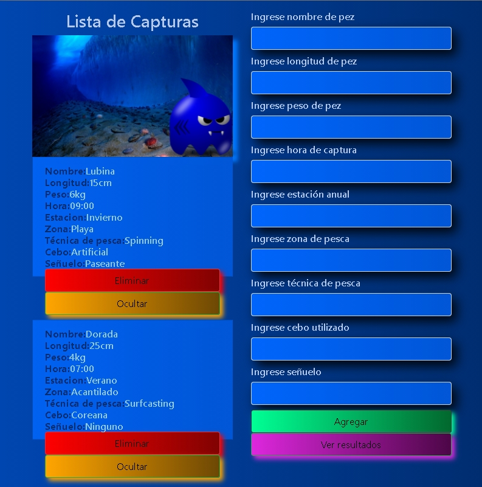

<h1>agendaPesca</h1>

Agenda de pesca creada con React hooks.Como es de pesca he usado los hooks o anzuelos para programar ,¡¡¡¡IMPORTANTE SABER ESTO!!!. Si vas a hacer aplicaciones relacionadas con anzuelos usa los hooks o la aplicación no correrá.

<h2>Lenguaje</h2>

Javascript

<h2>Framework</h2>

React

<h2>Código</h2>

Hooks

<h1>Enlace a vídeo en You Tube</h1>

 <a href="https://youtu.be/jtkl8gHECZE">ACCEDE A VÍDEO EN YOU TUBE</a> 